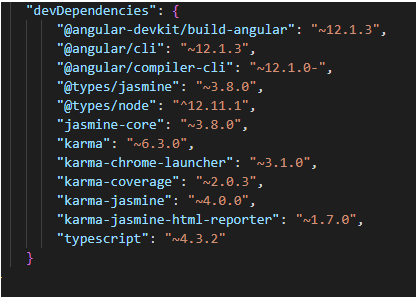

<h1 algin="center">1° Progetto Angular: Job Search App</h1>

  
Sommario

  <ol>
    <li>
      <a href="#informazioni-sul-progetto">Informazioni sul progetto</a>
      <ul>
        <li><a href="#costruito-con">Costruito con</a></li>
      </ul>
    </li>
   <li><a href="#descrizione">Descrizione</a>
     <ul>
        <li><a href="#struttura-repository">Struttura Repository</a></li>
        <li><a href="#Download-e-testare-app-in-locale">Download e testare app in locale</a></li>
      </ul>
    </li>
   <li><a href="#licenza">Licenza</a></li>
  <ol>

<!-- Informazioni sul progetto-->

## Informazioni sul progetto

La finalità di questo progetto è quella di sviluppare un'applicazione usando il framework Angular per la visualizzazione degli annunci di lavoro utilizzando la piattaforma <a href="https://www.themuse.com/developers/api/v2">The muse</a>.

La piattaforma The Muse offre semplici APIs per la ricerca di annunci di lavoro ma anche per avere informazioni relative ad un'azienda in particolare.

L'applicazione è stata deployata su Firebase:
- <h4>Link Firebase: (https://job-search-app-5bf69.web.app)</h4>

#### <h3>Costruito con:</h3>

<b>Framework</b>:

- [Angular] (https://angular.io/)
- [Bootstrap] (https://getbootstrap.com/)

<b>APIs</b>:

- [APIs offerte dalla piattaforma <b>The Muse</b>] (https://www.themuse.com/developers/api/v2)

<b>Libreria</b>

- [Bootstrap Icons] (https://icons.getbootstrap.com/)
- [Angular materials] (https://material.angular.io/)

<!--Descrizione-->

## Descrizione

### Struttura Repository

<h4>Cartella img-README</h4>
Contiene le immagini presenti nel README.md

<h4>Cartella src</h4>

  
Cartella src

   <ol>
     <li>
      Cartella app: contiene i file dei componenti in cui sono definiti la logica e i dati dell'applicazione.
      Componenti, modelli e stili angolari vanno qui.
      Per esempio:
      <ol>
        <li>
          app/app.componets.ts: Definisce la logica del componente radice dell'applicazione, denominato AppComponent.
          La vista associata a questo componente radice diventa la radice della gerarchia della vista quando si aggiungono componenti e servizi all'applicazione.
        </li>
        <li>app/app.component.html definisce il modello HTML associato all'AppComponent radice.</li>
        <li>app/app.component.css definisce il foglio di stile CSS di base per L'AppComponent radice.</li>
        <li>app/app.component.spec.ts definisce uno unit test per l'AppComponent radice.</li>
        <li> app/app.module.ts definisce il modulo radice, denominato AppModule, che indica ad Angular come assemblare l'applicazione. 
              Man mano che si aggiungono altri componenti all'app, questi devono essere dichiarati qui.
        </li>
     </ol>
  </li>
   
  <li>Cartella assets: contiene immagini e altri file di risorse da copiare cosi come sono quando crei l'applicazione.</li>
   
  <li>
     Cartella environments: contiene le opzioni di configurazione della build per particolari ambienti di destinazione
   </li>
   <li>Altri file come:
     <ol>
       <li>
        favicon.ico: un'icona da utilizzare per questa applicazione nella barra bookmark.
       </li>
       <li>index.html: La pagina HTML principale che viene publicata quando qualcuno visita l'app.</li>
       <li> 
         test.ts: Il punto di ingresso principale per i tuoi unit test, con alcune configurazioni specifiche   di  Angular.
       </li>
     </ol>
   </li>
 <ol>

- La cartella "src" contiene i file di origine per il progetto dell'applicazione a livello di root.

<h4>File di configurazione dell'applicazione</h4>

I file di configurazione specifici dell'applicazione per l'applicazione root risiedono al livello di root dell'area di lavoro 
Per esempio:
<ol>
 <li>Karma.conf.js: configurazione carma specifica per l'applicazione</li>
 <li>
   tsconfig.app.json: configurazione TypeScript specifica per l'applicazione, incluse le opzioni del compilatore di modelli TypeScript e Angular
 </li>
 <li>
   tsconfig.spec.json: configurazione TypeScript per i test dell'applicazione.
 </li>
 <li>tslint.json: Configurazione TSLint specifica per l'applicazione</li>
</ol>

### Funzionalità dell'applicazione
Nella home page dell'applicazione vengono visualizzati degli annunci di lavoro per la categoria Engineering con le informazioni base (es. figura lavorativa ricercata, id, luogo, livello, data di pubblicazione).
Di default vengono visualizzati annunci di lavoro di qualsiasi livello lavorativo (Entry level, Mid-level,Senior level).

Cliccando sul nome della figura lavorativa ricercata in ciascuno annuncio, si viene reindirizzati alla pagina di detaglio dell'annuncio di lavoro. In questa pagina sono presenti tutte le informazioni relative all'annuncio e all'azienda.
La barra di ricerca permette all'utente di cercare gli annunci in base al livello lovarativo. La ricerca può essere effettuata per un livello lavorativo alla volta , non sono consentite scelte multiple.

Quando si passa dalla home page alla pagina di dettaglio di ciascun annuncio si nota che la barra di ricerca 
rimane fissa, questo permette all'utente pur trovandosi nella pagina di dettaglio di un'annuncio di poter effetuare una nuova ricerca. 
Sempre nella paggina di dettaglio sotto la barra di ricerca è presente un collegamento "JOB LIST" cliccando su di esso si ritorna alla home page.

### Download e testare app in locale

- Sul proprio dispositivo è necessario installare: 
   - Nodo.js
   - gestore di pachetti npm. 
Le applicazioni Angular, Angular CLI e Angular dipendono dai pachetti npm per molte caratteristiche e funzioni.

L'app può essere testata in locale eseguendo i seguenti passaggi:

- Clonare il repository del progetto in locale 

- Installare le "dependencies" e "devDependencies" che sono riportate nel file package.json tramite il comando :
  
  npm install <dependencies o devDependencies>
  
   
  

Successivamente installare anche:
- npm install @fortawesome/fontawesome-svg-core
- npm install @fortawesome/fontawesome-common-types
  

- Testare l'app in locale tramite il comando ng serve.
Il comando "ng serve" crea e serve l'app, ricostruendola in base alle modifiche ai file .
Una volta che l'app è stata creata e servita andare al seguente link <a>http://localhost:4200/**</a> oppure cliccare sul link riportato nel terminale, vedere immagine seguente.

## Licenza

    Distribuito con licenza MIT. Vedere "LICENSE" per ulteriori informazioni.
